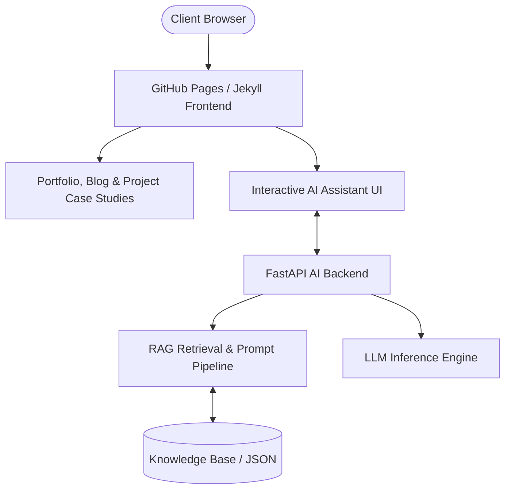

# Lokesh Kumar Jayswal — Portfolio & AI Engineering Platform

A personal developer portfolio, technical blog, and integrated Retrieval-Augmented Generation (RAG) assistant built with **Jekyll**, **Ruby**, **Python (FastAPI)**, and **Docker**[cite: 1]. Hosted on GitHub Pages with automated CI/CD deployment pipelines[cite: 1].

---

## System Architecture



---

## Tech Stack & Tooling

* **Frontend & Static Site Engine**: Jekyll, Liquid, Tailwind/Custom CSS, HTML5, JavaScript[cite: 1]
* **AI & Backend Services**: Python, FastAPI, PyTorch, LangChain, Uvicorn[cite: 1]
* **Data & Storage**: PostgreSQL, Redis, Vector Embeddings, JSON/YAML data stores[cite: 1]
* **DevOps & CI/CD**: Docker, GitHub Actions (`jekyll.yml`, `pages.yml`), Git[cite: 1]

---

## Featured Engineering Projects

| Project | Domain | Key Architecture / Tech | Metrics & Impact |
| :--- | :--- | :--- | :--- |
| **[Production ML Inference API](_projects/fastapi-prediction-api.md)**[cite: 1] | Backend & MLOps[cite: 1] | FastAPI, Redis Caching, Docker, PyTorch[cite: 1] | **48ms** p95 latency, **1.1k+ RPM** throughput |
| **[Deep Sequence NLP Classifier](_projects/nlp-rnn-lstm-project.md)**[cite: 1] | NLP & Deep Learning[cite: 1] | Bi-LSTM, AdamW, PyTorch DataLoader[cite: 1] | **91.4%** Macro F1-score, **35%** speedup |
| **[Shiksha Sutram LMS AI Core](_projects/shiksha-sutram-lms-ai-core.md)**[cite: 1] | System Architecture & AI[cite: 1] | FastAPI, Vector DB, LangChain, PostgreSQL[cite: 1] | **< 10s** exam generation, **> 94%** accuracy |
| **[Autonomous Telegram AI Assistant](_projects/telegram-ai-bot.md)**[cite: 1] | Agents & Automation[cite: 1] | Asyncio, Redis Session Buffer, OpenAI API[cite: 1] | **200+** concurrent users, **100%** zero-drop |

---

## AI Assistant Microservice (`/ai-chatbot/backend`)

The repository includes a dedicated asynchronous backend microservice delivering portfolio-contextual question answering[cite: 1]:

* `services/retrieval_service.py`: Vector and keyword search over structured profile knowledge[cite: 1].
* `services/embedding_service.py`: Computes dense semantic representations for context matching[cite: 1].
* `services/prompt_service.py`: Manages bounded prompt templates to prevent model hallucinations[cite: 1].
* `services/response_builder.py`: Validates and streams responses back to the client interface[cite: 1].

---

## Local Development Setup

### 1. Clone the Repository
```bash
git clone https://github.com/Decoder76/decoder76.github.io.git
cd decoder76.github.io
```

### 2. Run the Jekyll Frontend
```bash
# Install Ruby dependencies
bundle install

# Start the local Jekyll server
bundle exec jekyll serve --livereload
```
*Frontend runs at `http://localhost:4000`*

### 3. Run the AI Chatbot Backend
```bash
cd ai-chatbot/backend

# Set up virtual environment
python3 -m venv venv
source venv/bin/activate

# Install dependencies and start server
pip install -r requirements.txt
uvicorn main:app --reload --port 8000
```
*API docs available at `http://localhost:8000/docs`*

---

## Deployment & Workflows

Static deployment is automated via GitHub Actions workflows[cite: 1]:
* `.github/workflows/jekyll.yml`: Validates and builds the static Jekyll distribution[cite: 1].
* `.github/workflows/pages.yml`: Deploys production artifacts directly to GitHub Pages on merges to `main`[cite: 1].
