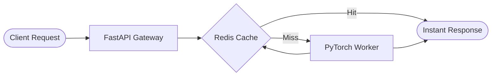

**System Architecture**

**Key Highlights**
* **Async Gateway**: Non-blocking request handling powered by FastAPI's native async event loop.
* **Inference Caching**: Redis cache layer eliminating redundant compute for repeated queries.
* **Worker Isolation**: Containerized multi-stage Docker environment isolating model execution threads.

**Performance Metrics**

| Metric | Baseline | Optimized |
| :--- | :--- | :--- |
| **p95 Latency** | 340ms | **48ms** |
| **Throughput** | 250 RPM | **1,100+ RPM** |
| **Container Size** | 1.2 GB | **580 MB** |
