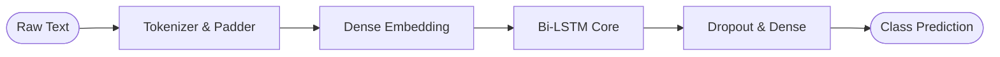

**Pipeline Flow**

**Key Highlights**
* **Bidirectional Context**: Dual hidden states preserving forward and backward semantic signals.
* **Gradient Stability**: Gradient clipping and AdamW optimization eliminating vanishing gradients.
* **Tensor Batching**: Memory-mapped PyTorch DataLoaders accelerating epoch convergence.

**Performance Metrics**

| Metric | Standard RNN | Bi-LSTM Pipeline |
| :--- | :--- | :--- |
| **Macro F1-Score** | 76.2% | **91.4%** |
| **Epoch Time** | 4.2 min | **2.7 min** |
| **Loss Convergence** | 24 Epochs | **12 Epochs** |
