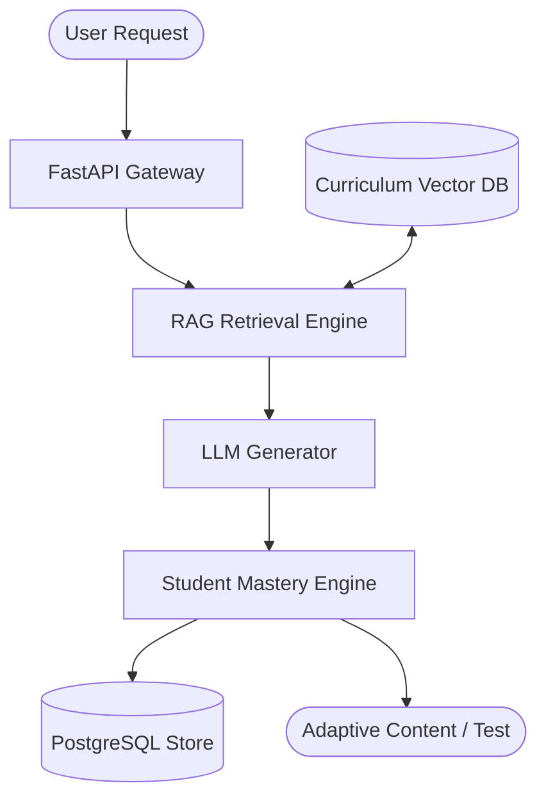

**System Architecture**

**Key Highlights**
* **Grounded Retrieval**: Vector similarity search preventing curriculum hallucinations.
* **Adaptive Scoring**: Real-time evaluation matrix calibrating quiz difficulty against past attempts.
* **Decoupled Engine**: RESTful microservice integrating with external LMS backends.

**Performance Metrics**

| Metric | Legacy / Manual | AI Core Engine |
| :--- | :--- | :--- |
| **Exam Generation Time** | 45 min | **< 10 sec** |
| **Retrieval Relevance** | 68% | **> 94%** |
| **Service Uptime** | 98.5% | **99.9%** |
