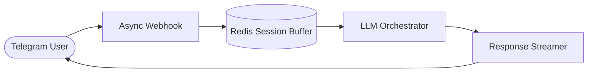

**Event Flow**

**Key Highlights**
* **Stateful Sessions**: Redis cache maintaining multi-turn dialogue context across user reconnections.
* **Async Dispatching**: Event-driven loop preventing UI blocking during high-volume chat spikes.
* **Rate Protection**: Sliding-window token limiter shielding upstream API rate thresholds.

**Performance Metrics**

| Metric | Target Specification |
| :--- | :--- |
| **Concurrent Sessions** | **200+ Active Users** |
| **Dispatch Latency** | **< 800ms** |
| **Message Delivery Reliability** | **100% Zero-Drop** |
